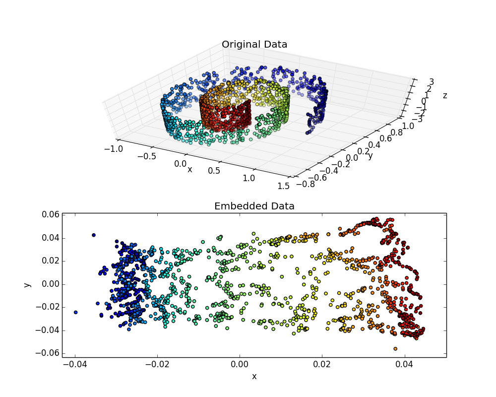

## Demo Laplacian Eigenmaps

This file uses a toy dataset of points sampled from a "swiss roll". Such a dataset exemplifies a low-dimensional manifold (2D) embedded in a higher dimensional space (3D). Using an algorithm based on the normalized Graph Laplacian, we can recover the 2D manifold.

The image below shows the set of points, where each point has been assigned a unique color to help identify the topology of the manifold. The topology is preserved and emphasized in the embedding space. The concentration that is occuring near the green and blue points is explained in my paper <a href="http://epubs.siam.org/doi/10.1137/110839370">A Random Walk on Image Patches</a> 

